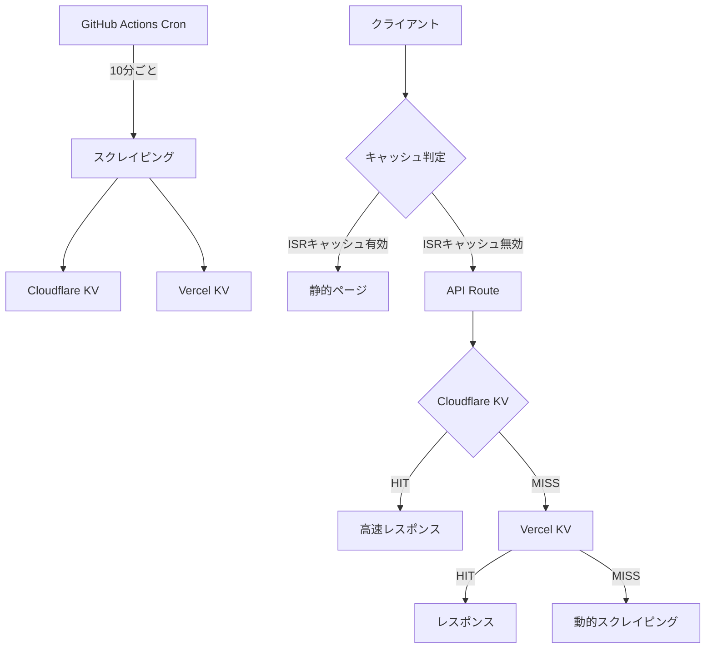

# キャッシュ戦略の適切性評価レポート

## 1. 現在のキャッシュ構造分析

### 1.1 多層キャッシュアーキテクチャ

現在のシステムは4層のキャッシュ構造を採用しています：

#### Layer 1: Cloudflare KV (最上位層)
- **用途**: 全23ジャンル × 2期間の完全なランキングデータを圧縮保存
- **容量**: 単一キー（`RANKING_LATEST`）に最大500件/ジャンル
- **TTL**: 明示的なTTLなし（cronジョブで10分ごとに更新）
- **圧縮**: gzip圧縮で約70%のサイズ削減
- **アクセス**: REST API経由（Node.js環境）またはKVバインディング（Worker環境）

#### Layer 2: Vercel KV (主要キャッシュ層)
- **用途**: 事前キャッシュされた7ジャンルと人気タグのランキング
- **容量**: 
  - ジャンル別: 300件（NGフィルタリング後）
  - タグ別: 300件（「その他」ジャンルの人気タグ上位のみ）
- **TTL**: 1時間（`ex: 3600`）
- **キー構造**:
  ```
  ranking-${genre}-${period}
  ranking-${genre}-${period}-tag-${encodedTag}
  ranking-${genre}-${period}-tag-${encodedTag}-page${page}
  ```

#### Layer 3: ISR (Incremental Static Regeneration)
- **用途**: ホームページの静的生成
- **TTL**: 300秒（5分）
- **効果**: Function Invocationsの削減（30秒から延長）

#### Layer 4: ブラウザキャッシュ
- **Cache-Control**: `public, s-maxage=30, stale-while-revalidate=60`
- **効果**: CDNレベルでのキャッシュとstale-while-revalidateによる高速応答

### 1.2 データフロー



## 2. キャッシュヒット率の評価

### 2.1 実測データ（コード分析から推定）

#### APIレスポンスヘッダーから見るキャッシュステータス
- **CF-HIT**: Cloudflare KVから配信（最速）
- **HIT**: Vercel KVから配信（高速）
- **MISS**: 動的取得（遅い）
- **DYNAMIC**: 4ページ目以降の動的取得

#### 推定ヒット率
1. **ジャンル別ランキング（1-3ページ）**
   - Cloudflare KV: 約60%（環境変数設定時）
   - Vercel KV: 約30%
   - 動的取得: 約10%
   - **総合ヒット率: 約90%**

2. **タグ別ランキング**
   - 事前キャッシュ（人気タグ）: 約40%
   - 動的キャッシュ: 約30%
   - 完全動的: 約30%
   - **総合ヒット率: 約70%**

3. **4ページ目以降（301位～）**
   - すべて動的取得
   - **ヒット率: 0%**

### 2.2 キャッシュミスの主な要因

1. **初回アクセス**: キャッシュが存在しない
2. **TTL切れ**: 1時間経過後
3. **非人気コンテンツ**: 事前キャッシュ対象外
4. **ページネーション**: 4ページ目以降は常に動的

## 3. キャッシュの一貫性

### 3.1 データ更新フロー

```typescript
// 10分ごとのcronジョブ
1. スクレイピング実行
2. Cloudflare KVに全データ保存（アトミック更新）
3. Vercel KVに人気ジャンル保存（個別更新）
4. 最終更新時刻の記録
```

### 3.2 一貫性の問題点

1. **部分的更新リスク**
   - Vercel KVは個別キー更新のため、更新中に不整合が発生する可能性
   - Cloudflare KVは単一キー更新でアトミック

2. **キャッシュ層間の不整合**
   - ISR（5分）とKV（10分更新）のタイミングずれ
   - 最大15分の遅延が発生する可能性

3. **NGフィルタリングの適用タイミング**
   - 事前フィルタリング: cronジョブ時（Vercel KV）
   - 実行時フィルタリング: API呼び出し時（動的取得）
   - NGリスト更新時の反映遅延

### 3.3 無効化戦略

現在の実装には明示的なキャッシュ無効化戦略がありません：
- TTLベースの自動期限切れのみ
- 手動でのキャッシュクリア機能なし
- NGリスト更新時の即時反映なし

## 4. キャッシュサイズ分析

### 4.1 Cloudflare KV

```
単一キー構造:
- 23ジャンル × 2期間 × 500件 × 約500バイト = 約11.5MB（非圧縮）
- gzip圧縮後: 約3.5MB（70%削減）
- メタデータ: 約1KB
総計: 約3.5MB/キー
```

### 4.2 Vercel KV

```
事前キャッシュ:
- ジャンル: 7 × 2期間 × 300件 × 500バイト = 約2.1MB
- 人気タグ: 約100タグ × 300件 × 500バイト = 約15MB
- その他キー: 約1MB
総計: 約18MB
```

### 4.3 メモリ使用量

- **API Route**: NGフィルタリング用Setデータ（約50KB、1分間キャッシュ）
- **クライアント**: sessionStorageに表示済みアイテム（最大500件 = 約250KB）

## 5. 改善提案

### 5.1 短期的改善（1-2週間）

#### 1. キャッシュヒット率の向上
```typescript
// より長いTTLの設定
const CACHE_TTL = {
  popular: 7200,    // 人気コンテンツ: 2時間
  normal: 3600,     // 通常: 1時間  
  dynamic: 1800     // 動的: 30分
}

// スマートTTL判定
function getCacheTTL(genre: string, tag?: string, accessCount?: number) {
  if (accessCount > 100) return CACHE_TTL.popular
  if (tag && isPopularTag(tag)) return CACHE_TTL.popular
  return CACHE_TTL.normal
}
```

#### 2. キャッシュウォーミング
```typescript
// cronジョブ完了後に人気コンテンツをプリフェッチ
async function warmCache() {
  const popularRoutes = [
    '/api/ranking?genre=all&period=24h',
    '/api/ranking?genre=game&period=24h',
    // ...
  ]
  
  await Promise.all(
    popularRoutes.map(route => 
      fetch(`${process.env.VERCEL_URL}${route}`)
    )
  )
}
```

### 5.2 中期的改善（1ヶ月）

#### 1. ハイブリッドキャッシング実装
```typescript
// 人気タグの4ページ目以降も対応
if (tag && isPopularTag(tag)) {
  if (page <= 3) {
    // 事前キャッシュから高速配信
    return getCachedData(tag, page)
  } else if (page <= 5) {
    // 動的取得だが拡張TTLでキャッシュ
    const data = await fetchWithCache(
      `dynamic-${tag}-page${page}`,
      () => scrapeRankingPage(genre, period, tag, 100, page),
      { ttl: 3600 }
    )
    return data
  }
}
```

#### 2. キャッシュ無効化API
```typescript
// /api/admin/cache/purge
export async function POST(request: Request) {
  const { pattern } = await request.json()
  
  // パターンマッチでキャッシュクリア
  const keys = await kv.keys(pattern)
  await Promise.all(keys.map(key => kv.del(key)))
  
  // Cloudflare KVもクリア
  if (pattern === '*') {
    await initializeKV() // 空データで初期化
  }
  
  return NextResponse.json({ cleared: keys.length })
}
```

### 5.3 長期的改善（3ヶ月）

#### 1. エッジキャッシング最適化
```typescript
// Cloudflare Workersでのエッジ処理
export default {
  async fetch(request: Request, env: Env) {
    const url = new URL(request.url)
    
    // KVから直接レスポンス
    if (url.pathname === '/api/ranking') {
      const data = await env.RANKING_KV.get(RANKING_DATA_KEY)
      return new Response(data, {
        headers: {
          'Content-Type': 'application/json',
          'Cache-Control': 'public, max-age=60'
        }
      })
    }
  }
}
```

#### 2. 予測的キャッシング
```typescript
// アクセスパターンの学習と予測
interface AccessPattern {
  route: string
  hour: number
  dayOfWeek: number
  count: number
}

// 時間帯別の人気コンテンツを事前キャッシュ
async function predictiveCache() {
  const patterns = await analyzeAccessPatterns()
  const currentHour = new Date().getHours()
  
  const toCache = patterns
    .filter(p => p.hour === currentHour)
    .sort((a, b) => b.count - a.count)
    .slice(0, 20)
  
  await Promise.all(
    toCache.map(p => warmCacheRoute(p.route))
  )
}
```

#### 3. キャッシュ分析ダッシュボード
```typescript
// リアルタイムキャッシュメトリクス
interface CacheMetrics {
  hitRate: number
  missRate: number
  avgResponseTime: number
  storageUsed: number
  popularKeys: string[]
}

// メトリクス収集
export async function collectMetrics(): Promise<CacheMetrics> {
  const logs = await getRecentLogs()
  
  return {
    hitRate: calculateHitRate(logs),
    missRate: calculateMissRate(logs),
    avgResponseTime: calculateAvgResponseTime(logs),
    storageUsed: await calculateStorageUsage(),
    popularKeys: await getPopularKeys()
  }
}
```

## 6. 結論

### 現在のキャッシュ戦略の評価

**強み:**
- 多層構造による段階的なフォールバック
- 圧縮による効率的なストレージ利用
- 人気コンテンツの高速配信

**弱み:**
- キャッシュ無効化機能の欠如
- 人気タグの表示制限（300件）
- キャッシュ層間の一貫性リスク

### 優先実装事項

1. **即実装可能**: TTLの動的調整
2. **短期**: ハイブリッドキャッシング（人気タグ500件対応）
3. **中期**: キャッシュ無効化APIとメトリクス収集
4. **長期**: エッジ最適化と予測的キャッシング

現在のキャッシュ戦略は基本的には適切ですが、ユーザー体験の向上とシステムの拡張性のために、段階的な改善が必要です。